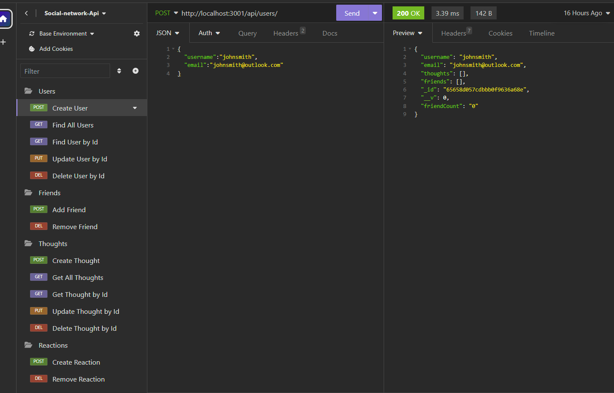

# < Social-Network-API >

## Description

GIVEN a social network API
WHEN I enter the command to invoke the application
THEN my server is started and the Mongoose models are synced to the MongoDB database
WHEN I open API GET routes in Insomnia for users and thoughts
THEN the data for each of these routes is displayed in a formatted JSON
WHEN I test API POST, PUT, and DELETE routes in Insomnia
THEN I am able to successfully create, update, and delete users and thoughts in my database
WHEN I test API POST and DELETE routes in Insomnia
THEN I am able to successfully create and delete reactions to thoughts and add and remove friends to a user’s friend list

## Table of Contents

- [Installation](#installation)
- [Usage](#usage)
- [Credits](#credits)
- [License](#license)
- [Features](#features)
- [How to Contribute](#how-to-contribute)
- [Tests](#tests)

## Installation

N/A

## Usage

Here is a walkthrough video link: https://drive.google.com/file/d/1eWWAT51yU5fxnYiZHqI9Ri9x1ZOxxziw/view 

## Credits

Giselle Reyes, and the instructors in the UM Web Development course for providing assistance with the api routes

## License

## Features

Database with functioning API routes for testing

## How to Contribute

Personal challenge

## Tests

Used VS Code and Insomnia